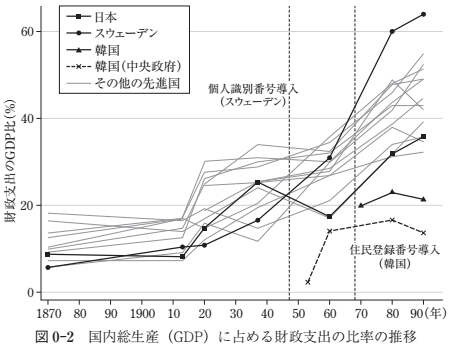

# なぜ、インドなのか？
## 行政サービスが確立した後からのデジタルID変革の難しさ
諸外国から見て行こう。韓国、スウェーデンでは、デジタルIDの浸透が先でその後に行政サービス導入が図られた。そのため、デジタルIDに対応すると行政サービスの恩恵を受けられたこともあり、自然と市民に受入られた。

しかし、日本やアメリカの場合は、先に行政サービスが確立された。その後でデジタルIDを対応しようとしたため、市民は、「なぜ？デジタルIDを導入するのか？従来（サイロ化したシステム or アナログ or 紙）サービスで十分である。」の意識が定着したため、導入に何度も頓挫した経験を持つ。
> 東大教授資料より図と資料を引用。先生に確認

一方、インドの場合はどうであろうか。実は、インドも日本やアメリカと同様、行政サービスが確立した後でのデジタルID変革パターンに該当する。
インドの場合、計画よりも市民がデジタルサービス享受を受けれるデジタルID変革推進ありきを優先して導入を行ってきた。個人情報取り扱いについては、何度も裁判上での議論を尽くし、上位目標を洗練してコンセントマネージャ（個人データを本人の同意のもと、プライバシーに配慮しつつ安全に第三者と共有する）の基で構築を進めてきたのである。

> 岩崎さんよりコンセントマネージャ図と資料を引用。確認

## オープンAPIとして複数国が採用している

先進国としては、エストニア、シンガポールの名前があがる。しかし、これらの国々は、人口約133万人、564万人である。地理上等の理由により、仕組みに地域特化が行われているため、汎用性を有しているとはいいがたい。
インドの場合は、オープンソースでの提供での設計が意識されており、複数メンバーでのレビューを受けて構築されてきた形跡がある。
また、最近は、インディアスタックからDPI（デジタル・パブリック・インフラストラクチャ）へ呼び名を変えており、国連標準化を意識しているのではないかと推察される。
2023年9月末現在において、インド含め18か国にDPIを推進中である。
トーゴ、ギニア、シエラレオネ、ブルキナファソ、ニジェール、モロッコ、エチオピア、マダガスカル、フィリピン、スリランカ、 
アルメニア、スリナム、アンティグア、バルバドス、トリニダード・トバゴ、パプアニューギニア、モーリシャス
※mosip、businessline 情報

## ラストワンマイルまでのサービス提供と行政形態
インドの場合は、国＋州を合わせた36の行政区で約14億人の行政サービスをカバーしている。

登録間違いもまだまだ散見されるものの、訂正の積み重ねがあるべき行政を目指している状況である。
